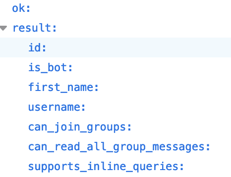

# nusc-queue-bot
Implements a Telegram bot for small to medium-scale events that involve queueing, such as for photobooths. Meant for NUSC events, but can be used in any other queue setting.

Inspired by deprecated queue bot counterparts written in Python here:
https://github.com/kwokyto/usp-queue-bot

This repository uses Go so that scalability with concurrency will not become an issue.

# progress so far
15/3/24: Local server hosting now functional.

# how to set up

## Register Your Bot on Telegram
*Accurate as of Apr 2024*
https://core.telegram.org/bots/tutorial
- Find @BotFather through Telegram global search
- Set up a bot with a desired name
- Obtain your top-secret API key from BotFather to control your bot by
- Test that you have established a link to your bot using this link, replacing "YOUR_BOT_TOKEN" with the API key
`https://api.telegram.org/bot<YOUR_BOT_TOKEN>/getMe`
- If you are un-successful, you will receive a 404 response. Check that you have entered the correct bot API token provided by BotFather, which should be in the form "XXXXX:YYYY", where X are numbers only and Y are alphanumeric.
  
    

- If you are successful, you will receive an OK response with some basic information about your bot in JSON.
  
    

- :warning: **Important:** Duplicate the .envSETUP key in this folder. Rename this file to ".env", and place in your API token after "BOT_TOKEN". This ".env" file is ignored (by Git) and not committed to GitHub to keep your API secret. (Don't pass this key around, or else people can control your bot!)

## Local deployment - Install Go (what version) and Postgres (what version)

## Remote deployment - Heroku

# running the server (local)
Cook your computer and keep it running

# running the server (remote)
Heroku or AWS or other services? not sure yet.
